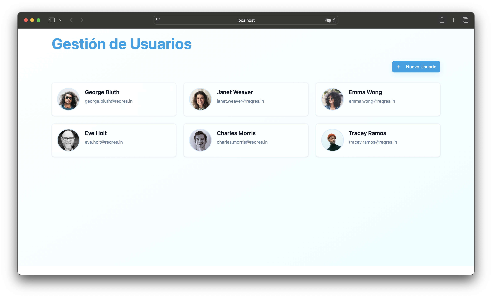
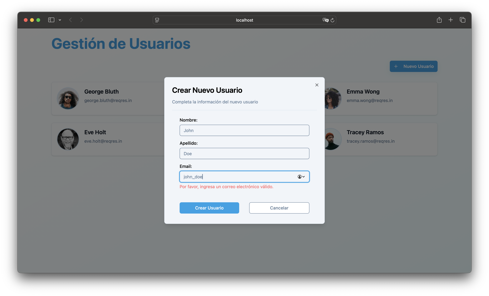
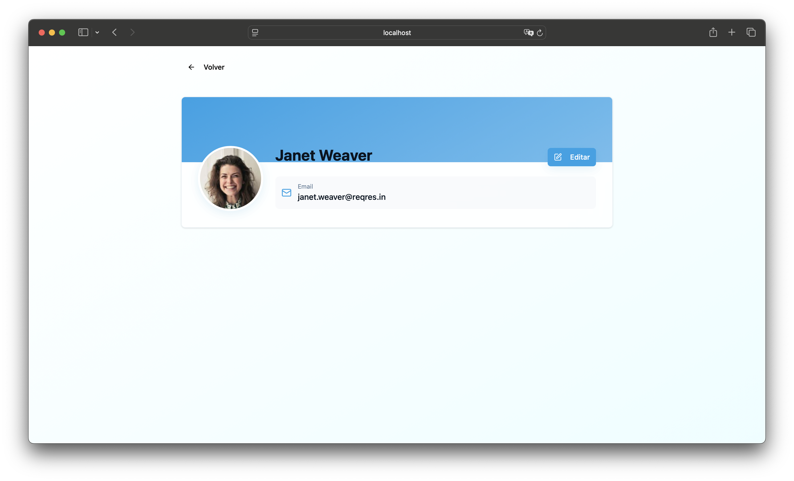
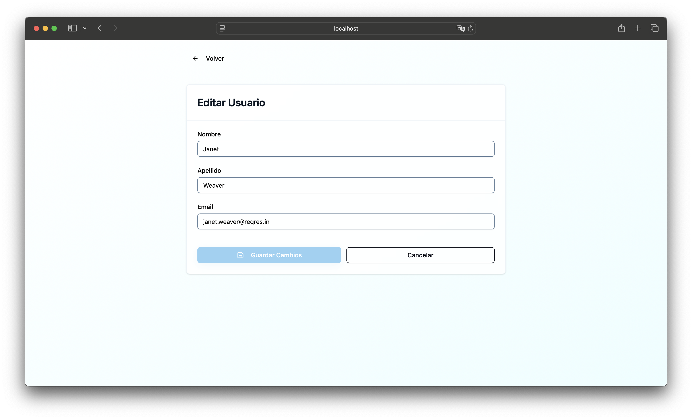

# MiGestor

A modern web application for user management built with React.

## Installation

This project was developed using pnpm, and it is recommended for its speed and efficiency.
However, you can also install dependencies using npm without any issues.

Follow these steps to get started:

1. **Clone the repository**:
   ```bash
   git clone git@github.com:Alan2Luna/MiGestor.git
   ```
2. **Navigate to the project directory**:
   ```bash
    cd MiGestor
   ```
3. **Install dependencies**:

   with pnpm (recommended):
   ```bash
   pnpm install
   ```

   Or with npm:
   ```bash
   npm install
   ```

## Environment Variables

Before running the application, you need to set up the environment variables:

1. **Copy the environment template**:
   ```bash
   cp .env.example .env
   ```

2. **Fill in the environment variables** in the `.env` file:
   - `VITE_API_BASE_URL`: The base URL for your API
   - `VITE_API_KEY`: Your API key for authentication

## Usage

To run the project locally, use the following command:

with pnpm:
```bash
pnpm dev
```

O con npm:
```bash
npm run dev
```

This will start a local development server and you can view the site at http://localhost:5173

## Screenshots

User management interface showing the list of users


Form to create a new user



Detailed view of a user


Form to edit an existing user

